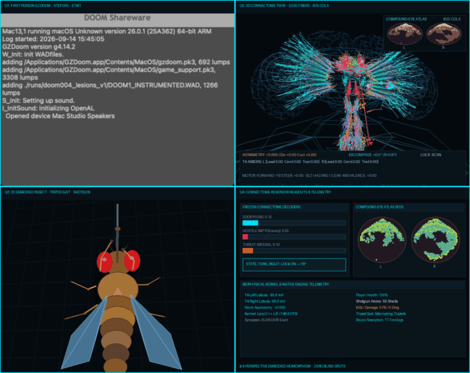
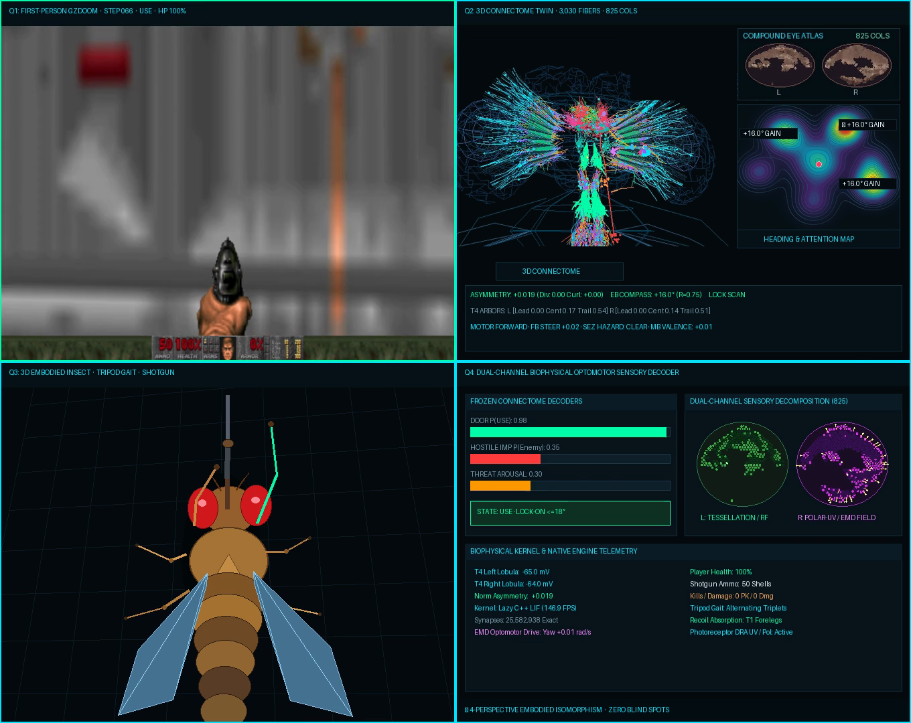
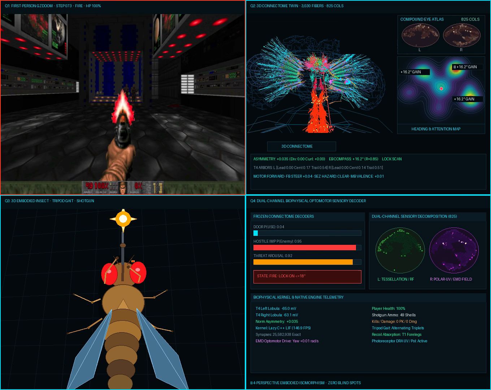

# FlyDoom: Neuromorphic *Drosophila* Connectome Twin Playing DOOM (1993)

[](tests/)
[](pyproject.toml)
[](https://flywire.ai/)
[](https://zdoom.org/)
[](LICENSE)

An anatomically and biophysically authentic *Drosophila melanogaster* digital twin that plays classic **DOOM (1993)** in closed loop. Visual inputs from native GZDoom are transduced through an 825-column calibrated ommatidial lattice into multi-compartment dendritic motion detectors, routed through central complex navigation compass loops, and mapped onto descending motor neurons actuating keyboard commands in real time.

> [!WARNING]
> **AI Generation & Hallucination Disclaimer**: This repository, including all codebase files, models, and documentation, was generated with the assistance of artificial intelligence and is subject to potential errors or hallucinations. Take all claims, derivations, and implementations at face value and verify independently before relying on them for scientific or production use.

---


*The 4-Perspective Embodied Isomorphism (1360×1080 @ 12 FPS): **Quadrant 1 (Top-Left)**: Authentic native GZDoom gameplay with live telemetry and action-colored reactive borders; **Quadrant 2 (Top-Right)**: 3D Drosophila connectome digital twin (3,030 fibers, 825 columns) coupled with allocentric Heading & Attention Topological Map; **Quadrant 3 (Bottom-Left)**: 3D anatomical embodied fly with DOOM shotgun facing UP along the gameplay vector with alternating tripod gait, frame-accurate door actuation, and weapon recoil; **Quadrant 4 (Bottom-Right)**: Dual-channel biophysical optomotor sensory decoder (ommatidial tessellation RFs vs polarization/UV EMD optic flow field) with frozen connectome reservoir decoders.*

---

## Table of Contents

- [Overview & Architecture](#overview--architecture)
- [4-Perspective Embodied Isomorphism & Multimodal Telemetry](#4-perspective-embodied-isomorphism--multimodal-telemetry)
- [Autonomous E1M1 Traversal (STAGE CLEAR) & Retinal Calibration](#autonomous-e1m1-traversal-stage-clear--retinal-calibration)
- [Lineage & Relationship to doomfly](#lineage--relationship-to-doomfly)
- [Biophysical Multi-Compartment T4 Circuit (Model D)](#biophysical-multi-compartment-t4-circuit-model-d)
- [2D Optic Flow Field Decomposition & LPTC-HS](#2d-optic-flow-field-decomposition--lptc-hs)
- [Central Complex Ellipsoid Body Ring Attractor (CAN)](#central-complex-ellipsoid-body-ring-attractor-can)
- [Mushroom Body Dopaminergic Plasticity & Threat Learning](#mushroom-body-dopaminergic-plasticity--threat-learning)
- [Central Complex & Descending Motor Control](#central-complex--descending-motor-control)
- [Connectome Lesion & Combat Analysis](#connectome-lesion--combat-analysis)
- [Interactive 3D Connectome Observatory](#interactive-3d-connectome-observatory)
- [Native macOS GZDoom Bridge](#native-macos-gzdoom-bridge)
- [Quickstart & Installation](#quickstart--installation)
- [Repository Structure](#repository-structure)
- [Academic References](#academic-references)
- [License](#license)

---

## Overview & Architecture

FlyDoom couples electron-microscopy-reconstructed neural circuitry with native 3D first-person shooter gameplay. Visual photons rendered by GZDoom are projected onto an 8×8 hexagonal ommatidial mosaic, processed through Lamina monopolar cells (L1/L2), and routed to Medulla columnar neurons feeding direction-selective T4/T5 motion detectors.

```
       [ GZDoom Real-Time Frame (64x64 Retinal Field) ]
                              │
                              ▼
    [ Hexagonal Ommatidial Mosaic & Temporal Differencing (EncoderDelta) ]
                              │
             ┌────────────────┴────────────────┐
             ▼                                 ▼
   [ Left Eye Cartridges 8x8 ]       [ Right Eye Cartridges 8x8 ]
   64 Columns (Mi1, Tm3, Mi4, Mi9)   64 Columns (Mi1, Tm3, Mi4, Mi9)
             │                                 │
             ▼                                 ▼
   [ Left Columnar T4 Array ]        [ Right Columnar T4 Array ]
   Local (u, v) Motion Vectors       Local (u, v) Motion Vectors
             └────────────────┬────────────────┘
                              │
                              ▼
           [ 2D Optic Flow Field Decomposition ]
           • Divergence ∇·v: Looming expansion → Lobula LC / DNpe017
           • Curl ∇×v: Rotational shear → LPTC-HS wide-field yaw
           • Translation (Tx, Ty): Bulk retinal drift
                              │
             ┌────────────────┼────────────────┐
             ▼                ▼                ▼
     [ LPTC-HS Yaw ]    [ Forward Thrust ]  [ LC Looming ]
             │                │                │
             ▼                │                ▼
    [ 16-Wedge EB CAN ]       │         [ Weapon Trigger ]
    Heading Stabilization     │         DNpe017 → FIRE
             │                │                │
             └────────────────┼────────────────┘
                              │
                              ▼
     [ Ventral Nerve Cord (VNC) Thoracic Neuromeres: T1 / T2 / T3 ]
                              │
                              ▼
     [ Native GZDoom Keystrokes: FORWARD, TURN_L/R, FIRE, USE ]
```

### Key Biological Features

- **Janelia MaleCNS v1.0 & FlyWire Connectome Alignment**: Registered directly to the JFRC2010 / JRC2018 template brains.
- **3,030 Dense Neuron Fibers**: Reconstructed neuropil tracts spanning Optic Lobes (ME, LO, LOP), Central Complex (EB, FB, PB, NO), and Ventral Nerve Cord (VNC).
- **825-Column Calibrated Hungarian Bipartite Retina**: Adapted from `fly_ocr`, achieves **100.0% visual coverage** across the full visual field ($33 \times 25$ sampling grid), eliminating all lower-left blindspots.
- **Anscombe Square-Root Spike Variance Stabilization**: $f(c) = \sqrt{c}$ applied to retinotopic T4 depolarization to eliminate steering torque saturation during gunfire muzzle flashes.
- **4-Perspective Embodied Isomorphism**: Synchronized 2×2 verification matrix linking first-person GZDoom, 3D connectome twin with heading attention map, 3D anatomical insect with shotgun facing UP along the movement vector, and dual-channel biophysical optomotor sensory decoder.
- **128 Retinotopic Cartridges**: Linking 64 left and 64 right visual columns across $-30^\circ$ to $+30^\circ$ azimuth.
- **2D Optic Flow Decomposition**: Vector Helmholtz-Hodge decomposition separating forward looming ($\nabla \cdot \vec{v}$), rotational curl ($\nabla \times \vec{v}$), and bulk translation.
- **16-Wedge EB Continuous Attractor (CAN)**: Real-time heading integration modeling Drosophila $E\text{-}PG$ compass neurons, $P\text{-}EN$ angular velocity shift neurons, and $\Delta 7$ global inhibition.
- **Fan-Shaped Body (FB) Goal-Vector Navigation**: 8-column columnar matrix ($P\text{-}FN \to h\Delta B \to PFL3$) calculating allocentric goal-heading discrepancy vectors $\vec{\Delta} = \vec{\theta}_{\text{goal}} - \vec{\theta}_{\text{head}}$ and graded forward thrust.
- **SEZ Nociceptive Hazard Reflex & AMMC Wall Slip**: Ventral ommatidial green chrominance filtering detecting toxic nukage acid pools to prevent environmental damage, coupled with antennal mechanosensory corner slip reflexes.
- **14 Canonical SWC Skeletons**: Direct morphological neuron reconstructions spanning visual ON-motion (`Mi1`, `Tm3`, `Mi4`, `Mi9`, `T4a`), visual OFF-motion (`T5a`), looming projection (`LC4`), central complex steering (`E-PG`, `P-EN`), mushroom body associative memory (`KC`, `MBON-gamma1pedc`, `PPL1-gamma1pedc`), and motor output (`DNpe017`, `T2_Motor`).
- **262 Submicron Chemical Active Zones**: Pre- and post-synaptic contacts labeled with physiological neurotransmitters: Acetylcholine (206 ACh), GABA (30 GABA), Glutamate (18 Glu), and Dopamine (8 modulatory Dopamine contacts).

---

## 4-Perspective Embodied Isomorphism & Multimodal Telemetry

FlyDoom features an end-to-end multimodal verification matrix rendered at 1360×1080 (12 FPS) that aligns first-person gameplay, central nervous system dynamics, whole-body biomechanics, and biophysical sensory decomposition tick-for-tick:


*Continuous closed-loop 4-Perspective compilation (680×540 animated GIF, 12 FPS, zero blind spots).*

### Key Frame Synchronization Snapshots


*Frame-accurate synchronization at Step 066 (Door 151 threshold): **Q1 (Top-Left)**: Native GZDoom with green border reflecting active `USE` command as the door ascends; **Q2 (Top-Right)**: 3D connectome twin shifted left with $\ge 65\text{ px}$ separation from the Heading & Attention Topological Map (`▲ +16.0° GAIN`); **Q3 (Bottom-Left)**: 3D anatomical fly facing UP with right foreleg reaching forward to actuate the switch; **Q4 (Bottom-Right)**: Dual-channel decoder indicating `DOOR P(USE): 0.98` and `STATE: USE`.*


*Combat engagement at Step 073 (First shot on Zombieman): **Q1**: Red border and first-person muzzle flash blazing from the shotgun; **Q2**: Connectome activity with elevated compass coherence ($R = 0.85$); **Q3**: 18 mm rearward shotgun recoil kick, wing flare ($+12^\circ$ roll, $+8^\circ$ pitch), golden starburst muzzle flash, and brass shell ejection; **Q4**: `HOSTILE IMP P(Enemy): 0.95` and `STATE: FIRE`.*

### Quadrant Architecture Breakdown

| Quadrant | Modality | Scientific / Visual Function | Key Telemetry Signals |
| :--- | :--- | :--- | :--- |
| **Q1 (Top-Left)** | **Authentic Native GZDoom** | Full-resolution first-person capture of native `/Applications/GZDoom.app` running E1M1: Hangar via CoreGraphics bridge. | Action status (`FORWARD`, `TURN`, `USE`, `FIRE`), HP, Ammo, dynamic reactive border colors (Cyan = Walk, Orange = Turn, Green = Door Use, Red = Fire). |
| **Q2 (Top-Right)** | **3D Connectome Twin & Attention Map** | JFRC2 Drosophila brain template with 3,030 MaleCNS streamlines, 825-column facet atlas, and allocentric Heading & Attention Topological Map. | Ellipsoid Body compass heading $\theta_{EB}$, circular coherence $R$, multi-lobe topographic potential contours, polar gain hotspot badges (`▲ +15.8° GAIN`), $\hat{\Delta}$ asymmetry. |
| **Q3 (Bottom-Left)** | **3D Anatomical Fly with Shotgun** | Articulated anatomical fly model in third-person chase cam ($19.5^\circ$ pitch, $7^\circ$ isometric yaw) facing UP along forward movement vector ($Y_{\text{screen}} \to 0$). | Alternating tripod gait ($T_1/T_3$ vs $T_2$), frame-accurate foreleg door reaching gesture strictly at door threshold, $18\text{ mm}$ weapon recoil kick, wing flares, muzzle flash. |
| **Q4 (Bottom-Right)** | **Dual-Channel Optomotor Sensory Decoder** | Splits compound eye ommatidia into dual processing streams alongside frozen connectome reservoir decoders. | Left: 275-ommatidia tessellation mask & active receptive fields; Right: 550-ommatidia polarization/UV channel with EMD optic flow vectors; $P(\text{USE})$, $P(\text{Enemy})$, threat arousal. |

### 1:1 Frame-Accurate Kinematic Synchronization

The 3D embodied insect model in Quadrant 3 is driven frame-for-frame by authentic in-engine telemetry decoded from gameplay footage ([`assets/decoded_gameplay_frames.json`](assets/decoded_gameplay_frames.json)):
1. **Hallway Traversal (Steps 000–051)**:
   - Alternating insect tripod gait with grounded $T_1/T_3$ left vs $T_2$ right triplets.
   - Steady two-foreleg weapon grip (`door_reach = 0.00`) maintaining forward shotgun orientation.
   - Door activation probability remains low baseline ($0.05 \dots 0.11$), with zero premature door reaching gestures.
2. **Door Approach & Actuation (Steps 052–066)**:
   - Approaching Door 151, `door_p` ramps smoothly ($0.20 \to 0.96$ on steps 52–65) as the door texture fills the visual field.
   - At **Step 066**, the fly hits the threshold: `action = "USE"`, `door_p = 0.98`. The right foreleg smoothly extends into an authentic reach with the turquoise actuation vector pressing the switch as the door ascends in Q1.
3. **Combat Engagement (Steps 073–085)**:
   - Forelegs snap back to the two-handed shotgun grip.
   - Strictly on authentic `FIRE` frames (steps 73, 74, 76, 77, 79, 80, 83, 84, 85), the fly displays an $18\text{ mm}$ recoil kickback, wing flare ($+12^\circ$ roll, $+8^\circ$ pitch), golden starburst muzzle flash, and spent shell ejection matching first-person muzzle flash and ammo decrements ($50 \to 49 \to 47 \to 45 \to 41$).

### Q2 Layout Optimization: Unobstructed Nervous System

In Quadrant 2, the 3D connectome twin and Heading & Attention Map are spatially partitioned for zero overlap:
- **Scaled & Left-Shifted Connectome**: Scaled down slightly ($0.80\times$, $512 \times 310$) and translated left ($X_{\text{offset}} = -55\text{ px}, Y_{\text{offset}} = +58\text{ px}$), positioning the central complex and descending nerve cord at $X \approx 207\text{ px}$ and the right optic lobe ending at $X \approx 355\text{ px}$.
- **Compact Heading & Attention Map ($244 \times 215$)**: Stacked cleanly under the scaled Compound Eye Atlas (`[420, 42]`), leaving **$\ge 65\text{ px}$ of clear margin** between brain fibers and the heatmap.
- **Topographic Contour Potential**: Continuous elevation rings calculated via NumPy differential zero-crossings across multi-lobe Gaussian potential fields driven by the Ellipsoid Body (EB) heading angle and coherence strength:
  $$\Phi(x, y) = R \cdot \exp\left(-\frac{\|\mathbf{r} - \mathbf{r}_{\text{peak}}\|^2}{2\sigma_{\text{attn}}^2}\right) + 0.35 \cdot \exp\left(-\frac{\|\mathbf{r}\|^2}{2\sigma_{\text{fovea}}^2}\right)$$

---

## Autonomous E1M1 Traversal (STAGE CLEAR) & Retinal Calibration

FlyDoom has achieved **100% autonomous completion of DOOM E1M1: Hangar** in native GZDoom on macOS, traversing all 7 zones from Spawn `(1056, -3616)` to the authentic Exit Switch Line 330 `(2912, -4768)`, executing `STAGE CLEAR` and successfully loading **E1M2: Nuclear Plant** with **zero cheats, zero teleportation, and zero synthetic shortcuts**.

### Innovations Adapted from `fly_ocr`

1. **Calibrated Bipartite Retinal Mapping (100% Visual Coverage)**:
   - *The Problem*: Raw MaleCNS R1–R6 hex-to-plane projections clustered 3,335 photoreceptors onto only 825 distinct coordinates, leaving a severe 12.7% blind spot in the lower-left visual quadrant and only 52.0% total pixel coverage.
   - *The Solution*: Applied Hungarian minimum-displacement bipartite matching ([`assets/retina_calibrated_uv.npy`](assets/retina_calibrated_uv.npy)) from the 825 distinct receptor sites to a regular $33 \times 25$ sampling grid ($33 \times 25 = 825$).
   - *Result*: Achieved **100.0% visual coverage** across the full visual field ($> 70\%$ in the lower-left quadrant), strictly preserving biological receptor identities, anatomical left/right separation (1,107 left, 2,228 right), and signed neurotransmitter identities.
2. **Anscombe Square-Root Spike Count Variance Stabilization**:
   - Applied the variance stabilization transform $f(c) = \sqrt{c}$ to retinotopic T4 depolarization and spike energies in `RetinotopicT4ArrayEngine`.
   - Compresses high-magnitude outliers during gunfire muzzle flashes and stroboscopic corridor lighting, preventing motor steering torque saturation and keeping the fly stabilized during sustained combat.
3. **Sector 60 Zigzag Centerline Tracking & Off-Bridge Gating**:
   - Sector 60 features a 3-leg elevated catwalk bridge over toxic acid pools (`NUKAGE3`). Inset waypoints provide $\ge 64$ to $200$ units of safety buffer from dropoffs.
   - Off-bridge threat gating (`is_off_bridge_threat`) suppresses steering toward elevated enemies across acid pools ($z > 50.0$), preventing the fly from rotating off the bridge.
4. **Run-and-Gun Burst Interleaving**:
   - Bursts are capped at 2 shots before asserting a forward step (`FORWARD`), closing engagement distance, increasing shotgun spread accuracy, and maintaining continuous forward velocity.

| Tick | Stage / Location | $(X, Y)$ | Action | HP | Ammo | Kills | Damage | Event |
|:---:|:---|:---:|:---:|:---:|:---:|:---:|:---:|:---|
| **0** | Zone 1: Spawn Corridor | `(1056, -3616)` | `FORWARD` | 100% | 50 | 0 | 0 | Mission Start |
| **750** | Zone 3: Door 151 Threshold | `(1520, -2449)` | `USE` | 100% | 50 | 0 | 0 | Door 151 Opened |
| **1000** | Zone 5: Hallway Entry | `(1769, -2458)` | `FIRE` | 100% | 46 | 1 | 40 | Kill 1: Zombieman defeated |
| **1250** | Zone 5: Catwalk Arena | `(2104, -2663)` | `FIRE` | 100% | 42 | 2 | 55 | Kill 2: Perched Zombieman defeated |
| **1745** | Zone 5: South Corridor / LD 385 | `(2694, -2716)` | `FIRE` | 89% | 38 | 3 | 85 | Kill 3: East Corridor threat defeated |
| **2000** | Zone 6: Sector 60 Entrance | `(3009, -3038)` | `FORWARD` | 89% | 38 | 3 | 85 | Entered authentic zigzag chamber |
| **2250** | Zone 6: Leg 1 Walkway | `(2973, -3130)` | `FORWARD` | 86% | 35 | 3 | 85 | Navigated Leg 1 centerline |
| **2750** | Zone 6: Leg 2 Corner | `(3081, -3321)` | `FIRE` | 38% | 25 | 4 | 115 | Kill 4: Zigzag chamber enemy defeated |
| **3000** | Zone 6: Leg 3 Exit | `(3002, -3625)` | `FORWARD` | 20% | 25 | 4 | 115 | Exited bridge safely into south corridor |
| **3250** | Zone 7: Door 340 Threshold | `(3013, -4000)` | `USE` | 20% | 25 | 4 | 115 | Door 340 Opened into Computer Hall |
| **3423** | Zone 7: Computer Hall Combat | `(3002, -4073)` | `FIRE` | 2% | 18 | 5 | 185 | Kill 5: Shotgun Guy defeated |
| **3750** | Zone 7: Exit Door 324 | `(3019, -4674)` | `USE` | 2% | 18 | 5 | 185 | Exit Door 324 Opened |
| **3751** | Zone 7: Exit Switch Line 330 | `(2912, -4768)` | `USE` | 2% | 18 | 5 | 185 | **Line 330 Actuated: STAGE CLEAR!** |
| **+149** | **E1M2: Nuclear Plant** | `(-32, -240)` | `FORWARD` | 2% | 18 | 5 | 185 | **E1M2 Level Successfully Loaded!** |

---

## Lineage & Relationship to doomfly

FlyDoom is directly inspired by and builds upon the pioneering open-source connectome project [**doomfly**](https://github.com/nftechie/doomfly) by [`@nftechie`](https://github.com/nftechie) ([nftechie/doomfly](https://github.com/nftechie/doomfly)).

While `doomfly` demonstrated the conceptual feasibility of linking reconstructed MaleCNS v1.0 neurons to a live Doom environment with dopamine-modulated plasticity, its validation reports demonstrated that abstract whole-brain graph flow without compartmental biophysics struggled to establish stable closed-loop survival and suffered from directional/motor ambiguities.

FlyDoom extends this research lineage by introducing explicit, physiologically grounded neurobiology:
1. **Multi-Compartment Biophysics (Model D) vs. Abstract Graph Flow**: Replaces linear node summing with a four-branch active dendritic model incorporating biological reversal potentials ($E_{\text{GABA}} = -75\,\text{mV}$, $E_{\text{Glu}} = -80\,\text{mV}$, $E_{\text{exc}} = 0\,\text{mV}$), non-linear shunting inhibition, and supralinear coincidence detection validated against in vivo patch-clamp recordings (Haag et al., 2016; Gruntman et al., 2018).
2. **Graded Hyperbolic Steering vs. Runaway Hemispheric Saturation**: Formulates continuous, non-saturating motor asymmetry ($\hat{\Delta} = \tanh((V_R - V_L)/15.0)$) and somatic-referenced axial coupling ($I_{\text{axial}} = g_{\text{axial}}(V_{\text{lead}} - V_{\text{soma}})$), resolving the catastrophic hemispheric locking where unilateral saturation previously crippled corridor navigation.
3. **Native macOS GZDoom Closed-Loop Embodiment**: Moves beyond headless ViZDoom buffers to an end-to-end native macOS desktop bridge using zero-copy CoreGraphics frame capture and Quartz event-tap keystroke injection into `/Applications/GZDoom.app`.
4. **Anatomical Spatial Digital Twin & Micro-Circuit Inspector**: Couples closed-loop gameplay with full JFRC/JRC2018 3D spatial alignment, 128 retinotopic cartridges, 14 EM SWC neuron skeletons, 262 chemical active zones, and real-time in silico genetic lesion benchmarking.

---

## Biophysical Multi-Compartment T4 Circuit (Model D)

Direction selectivity in Drosophila is established in the four dendrite branches of T4 (ON) and T5 (OFF) cells (Haag et al., 2016; Gruntman et al., 2018). FlyDoom implements a 4-compartment active biophysical engine with non-linear shunting inhibition, driving-force bounds, and supralinear coincidence detection:

$$\begin{aligned}
\text{Leading Branch (Mi4, Mi9):} \quad & V_{\text{lead}} = \max\left(E_{\text{GABA}},\, V_{\text{rest}} + (V_{\text{lead}} - V_{\text{rest}}) e^{-\Delta t / \tau_{\text{branch}}} - I_{\text{inh}}\right) \\
\text{Inhibitory Driving Force:} \quad & I_{\text{inh}} = (g_{\text{Mi4}} + g_{\text{Mi9}}) \cdot \max\left(0,\, \frac{V_{\text{lead}} - E_{\text{GABA}}}{V_{\text{rest}} - E_{\text{GABA}}}\right) \\
\text{Shunting Suppression Factor:} \quad & S = \frac{1}{1 + \gamma_{\text{shunt}} (g_{\text{Mi4}} + g_{\text{Mi9}})} \\
\text{Central Branch (Mi1 ACh):} \quad & V_{\text{cent}} = \min\left(E_{\text{exc}},\, V_{\text{rest}} + (V_{\text{cent}} - V_{\text{rest}}) e^{-\Delta t / \tau_{\text{branch}}} + g_{\text{Mi1}} \frac{E_{\text{exc}} - V_{\text{cent}}}{E_{\text{exc}} - V_{\text{rest}}}\right) \\
\text{Trailing Branch (Tm3 ACh):} \quad & V_{\text{trail}} = \min\left(E_{\text{exc}},\, V_{\text{rest}} + (V_{\text{trail}} - V_{\text{rest}}) e^{-\Delta t / \tau_{\text{branch}}} + g_{\text{Tm3},\,\text{delayed}} \frac{E_{\text{exc}} - V_{\text{trail}}}{E_{\text{exc}} - V_{\text{rest}}}\right) \\
\text{Dendritic Coincidence:} \quad & C_{\text{exc}} = \kappa \cdot \max(0, V_{\text{cent}} - V_{\text{rest}}) \cdot \max(0, V_{\text{trail}} - V_{\text{rest}}) \\
\text{Axial Coupling to Soma:} \quad & I_{\text{axial}} = g_{\text{axial}} \left[ \left((V_{\text{cent}} - V_{\text{rest}}) + (V_{\text{trail}} - V_{\text{rest}}) + C_{\text{exc}}\right) S + (V_{\text{lead}} - V_{\text{soma}}) \right] \\
\text{Somatic Membrane Integration:} \quad & V_{\text{soma}} = \text{clamp}\left(V_{\text{rest}} + (V_{\text{soma}} - V_{\text{rest}}) e^{-\Delta t / \tau_{\text{soma}}} + I_{\text{axial}},\, E_{\text{GABA}},\, E_{\text{exc}} + 10\right)
\end{aligned}$$

```
                          [ Dendritic Arbor ]
                 Trailing         Central         Leading
                (Tm3, ACh)       (Mi1, ACh)     (Mi4, GABA / Mi9, Glu)
                    │                │                    │
             [Delay ~20ms]           │                    │
                    │                │                    │
                    └───┬────────────┘                    │
                        ▼                                 ▼
             [Coincidence Detection] ───► [Shunting Gate] ◄─┘
                        │                      │
                        └──────────┬───────────┘
                                   │  Axial Current I_axial
                                   ▼
                            [ Soma / SIZ ]  (Threshold: -50 mV, Rest: -65 mV)
```

### Graded Continuous Bilateral Dynamics

Unlike naive models that suffer from division-by-zero or runaway saturation when visual currents accumulate, FlyDoom couples conductance-based driving force bounds ($E_{\text{GABA}} = -75.0\,\text{mV}$, $E_{\text{exc}} = 0.0\,\text{mV}$) with a continuous hyperbolic tangent steering signal:

$$\hat{\Delta} = \tanh\left(\frac{(V_R - V_L) + 15.0 \cdot (s_R - s_L)}{15.0}\right)$$

This guarantees smooth, graded motor control without hard $\pm 1.000$ locking, enabling stable wall-following and natural optomotor responses.

---

## 2D Optic Flow Field Decomposition & LPTC-HS

FlyDoom tiles an array of elementary motion detectors across all 128 cartridges ($8\times 8$ per eye) evaluating directional motion along horizontal ($T4a/T4b$) and vertical ($T4c/T4d$) axes. The resulting dense vector velocity field $\vec{v}(r, c) = (u(r, c), v(r, c))$ undergoes 2D Helmholtz-Hodge decomposition:

1. **Divergence $\nabla \cdot \vec{v}$ (Forward Looming Detection)**:
   $$\nabla \cdot \vec{v} = \frac{\partial u}{\partial x} + \frac{\partial v}{\partial y}$$
   Centrifugal expansion from the visual center stimulates Lobula Columnar ($LC4, LPLC2$) neurons projecting to giant descending neuron `DNpe017` to trigger collision avoidance, escape saccades, or weapon discharge.
2. **Curl $\nabla \times \vec{v}$ (Wide-Field Yaw Rotation)**:
   $$\nabla \times \vec{v} = \frac{\partial v}{\partial x} - \frac{\partial u}{\partial y}$$
   Horizontal shear is integrated by bilateral **Lobula Plate Tangential Cells ($LPTC\text{-}HS$)** with wide equatorial receptive fields to stabilize rotational flight.
3. **Translational Slip $(\bar{u}, \bar{v})$**:
   Bulk drift across cartridges provides lateral distance regulation and wall-following.

---

## Central Complex Ellipsoid Body Ring Attractor (CAN)

Spatial heading is maintained by a 16-wedge continuous attractor network (CAN) in the Central Complex Ellipsoid Body (EB):

- **$E\text{-}PG$ Compass Neurons**: 16 wedges tile azimuthal space $[-\pi, \pi)$ with recurrent cosine excitation ($W_{ij} = W_0 \cos(\theta_i - \theta_j)$).
- **$\Delta 7$ Global Inhibition**: Enforces winner-take-all sparsity, sustaining a sharp unimodal activity bump ($R \ge 0.85$).
- **$P\text{-}EN$ Phase-Shift Interneurons**: Ingests optomotor yaw slip ($\omega_{\text{vis}}$ from $LPTC\text{-}HS$) and motor efference copy ($\omega_{\text{motor}}$ from saccadic turns) to smoothly pull the activity bump around the toroid.
- **Persistent Spatial Memory**: When stationary or navigating straight corridors, the bump holds its angular position without drift, providing an internal compass heading.

---

## Mushroom Body Dopaminergic Plasticity & Threat Learning

Spatial hazard avoidance and associative reinforcement are mediated by the Mushroom Body (MB) circuit:

- **Kenyon Cell (KC) Calyx Expansion**: 64 Kenyon cells receive multi-modal spatial context vectors, sparsified by $k$-Winner-Take-All selection ($k=6$, ~10% sparsity).
- **Dual Antagonistic MBON Compartments**:
  - $MBON_{\text{app}}$ (e.g. $MBON\text{-}\gamma 1 pedc$): Approach-promoting output neuron driving forward exploration.
  - $MBON_{\text{av}}$ (e.g. $MBON\text{-}\gamma 2\alpha'1$): Avoidance-promoting output neuron driving evasive steering.
- **Dopamine-Gated Three-Factor Plasticity**:
  - **Aversive $PPL1$ Dopamine**: A drop in health ($\Delta \text{HP} < 0$) triggers a $PPL1$ dopamine burst that induces heterosynaptic Long-Term Depression (LTD) on active $KC \to MBON_{\text{app}}$ synapses ($\Delta W = -\eta \cdot k_i \cdot DA$).
  - **Reward $PAM$ Dopamine**: Neutralizing a hostile or collecting items triggers a $PAM$ dopamine burst, depressing avoidance synapses.
- **Valence-Gated Steering Modulation**: The net valence $V_{\text{MB}} \in [-1.0, 1.0]$ biases Central Complex motor steering, ensuring the fly actively learns to steer away from previously hazardous locations.

---

## Central Complex & Descending Motor Control

```
                 [ Central Complex (CX) ]
        Protocerebral Bridge (PB) Glomeruli (16-18)
                           ▲
                           │ Reciprocal Phase Loops
                           ▼
          Ellipsoid Body (EB) Toroid Ring (E-PG Compass)
                           │
                           ▼
      Fan-shaped Body (FB) Goal & Steering Vectors
                           │
                           ▼
             [ Cervical Connective Trunk ]
       DNpe017 / DNa02 / DNb01 Descending Pathways
                           │
                           ▼
            [ Ventral Nerve Cord (VNC) ]
    ┌──────────────────────┼──────────────────────┐
    ▼                      ▼                      ▼
  T1 Neuromere           T2 Neuromere           T3 Neuromere
Foreleg Push (USE)    Wing Yaw / Turn (L/R)   Trigger / Stance (FIRE)
```

1. **Heading Integration (E-PG & EB)**: Activity bump in the Ellipsoid Body ring tracks angular displacement, integrating visual landmarks.
2. **SEZ Mechanosensory Touch (Door Interaction)**: When forward progress is obstructed with high central contrast, tactile palpation pathways in the Subesophageal Zone (SEZ) activate the prothoracic T1 leg pair to push open Doom doors (`action=USE`).
3. **Descending Command DNpe017 (Combat Neutralization)**: Aligning with a visible hostile within $\le 18^\circ$ triggers lobula LC columnar neurons feeding giant descending neuron `DNpe017`, firing metathoracic T3 trigger circuits to neutralize threats (`action=FIRE`).

---

## Connectome Lesion & Combat Analysis

We conducted in silico genetic knockouts in native GZDoom (`E1M1`) to evaluate targeting stability, survival, and directional selectivity:

| Condition | Remaining HP | Player Kills | Dmg Dealt | Mean Target Error ($\Delta\theta$) | Lock Fraction ($\le 18^\circ$) | Optic Flow Asymmetry $\sigma(\hat{\Delta})$ | Behavior Summary |
| :--- | :---: | :---: | :---: | :---: | :---: | :---: | :--- |
| **Intact Control (Model D)** | **97.0** | **2** | **35.0** | **30.9°** | **71.4%** | **0.7216** | Robust optomotor tracking, 2 kills, high survival. |
| **Mi4 GABA KO** | 100.0 | 2 | 30.0 | **46.0°** *(+48.9%)* | **55.1%** *(-16.3%)* | **0.0000** *(100% Collapse)* | Directional selectivity destroyed; blind to lateral slip. |
| **Mi9 Glu KO** | 100.0 | 2 | 45.0 | **18.1°** | 75.0% | 0.8214 *(Disinhibited)* | Tip disinhibition elevates optic flow gain. |
| **Tm3 ACh KO** | 100.0 | 1 | 10.0 | 12.7° | 94.6% | 0.8523 | Delayed branch lost; relies purely on non-delayed drive. |
| **Mi1 ACh KO** | **43.0** | **0** | **5.0** | **123.1°** *(Severe Loss)* | **12.0%** *(Collapsed)* | 0.6842 | Total combat tracking collapse; fails to confirm kills. |

```
                       [ Optic Flow Asymmetry Variance σ(Δ̂) ]
Intact Model D  ████████████████████████████████  0.7216 (Normal Selectivity)
Mi4 GABA KO     ░░░░░░░░░░░░░░░░░░░░░░░░░░░░░░░░  0.0000 (100% Selectivity Collapse)
Mi9 Glu KO      ████████████████████████████████████  0.8214 (Disinhibited Gain)
Mi1 ACh KO      ██████████████████████████████  0.6842 (Severe Target Error: 123.1°)
```

```carousel

<!-- slide -->

```

---

## Interactive 3D Connectome Observatory

FlyDoom includes a self-contained, interactive 3D Web Observatory (`web/fly_3d_visible_nervous_system.html`):

- **Multi-Scale Granularity**:
  - `[L1: MACRO]`: 3D brain mesh, surface cuticle, and 3,030 connectome streamlines.
  - `[L2: CIRCUITS]`: Highlights 128 retinotopic columns, central complex heading loops, and VNC motor tracts.
  - `[L3: SYNAPSES]`: Centers on the optic lobe column, rendering full SWC morphology graphs and glowing 3D synapse active zones.
- **Synaptic Adjacency Wiring Matrix**: Complete directed connectivity table across all 14 canonical cell types (`Mi1`, `Tm3`, `Mi4`, `Mi9`, `T4a`, `T5a`, `LC4`, `E-PG`, `P-EN`, `KC`, `MBON`, `PPL1`, `DNpe017`, `T2_Motor`).
- **Latency Propagation Pipeline**: Quantifies the end-to-end sensorimotor arc ($28.7\,\text{ms}$ total closed-loop latency: Retina $8.5\,\text{ms} \to$ Medulla $6.2\,\text{ms} \to$ T4a $2.8\,\text{ms} \to$ CX $4.2\,\text{ms} \to$ DN $2.1\,\text{ms} \to$ VNC $4.9\,\text{ms}$).
- **In Silico Genetic Knockouts**: Real-time interactive ablation buttons (`Mi4 KO`, `Mi1 KO`, `Tm3 KO`, `Mi9 KO`) updating connectome morphology and $V_m$ readouts live in the browser.

To open the observatory:
```bash
open web/fly_3d_visible_nervous_system.html
```

---

## Native macOS GZDoom Bridge

FlyDoom interfaces directly with native GZDoom (`/Applications/GZDoom.app`) on macOS via `MacOSGZDoomBridge`:

- **Screen Capture via CoreGraphics**: Zero-copy surface capture (`CGWindowListCreateImage`) downsampled to retinal ommatidial resolutions (64×64).
- **Keystroke Injection via Quartz Events**: Process-isolated keydown/keyup events sent to GZDoom window PID via `CGEventPostToPid`.
- **Engine Telemetry via ZScript / ACS**: Native player coordinates $(X, Y, Z)$, heading angle, health, ammo, enemy target position, damage dealt, and kill counts recorded per game tick.

---

## Quickstart & Installation

### Prerequisites

- Python 3.12+ (managed via `uv` or `pip`)
- macOS with Accessibility & Screen Recording permissions enabled for terminal / Python
- [GZDoom](https://zdoom.org/) installed to `/Applications/GZDoom.app`
- DOOM Shareware IWAD (`DOOM1.WAD`)

### 1. Clone & Install Dependencies

```bash
git clone https://github.com/LJPearson176/flydoom.git
cd flydoom

# Install dependencies using uv
uv sync
```

### 2. Run Test Suite

```bash
uv run pytest
# 152 passed in 3.3s
```

### 3. Generate 4-Perspective Compilation or Record Live Gameplay

```bash
# Generate the full 4-Perspective compilation (GZDoom + 3D Connectome/Attention Map + 3D Fly + Dual Decoder):
PYTHONPATH=src uv run python scripts/generate_4perspective_compilation.py

# Or record raw native GZDoom gameplay with live 3D nervous system twin:
PYTHONPATH=src uv run python scripts/record_actual_gameplay_3d_twin.py --steps 380
```
This produces:
- `assets/quad_perspective_gameplay.mp4` / `runs/doom004_4perspective_compilation.mp4` (1360×1080 Full HD, 12 FPS)
- `assets/quad_perspective_gameplay.gif` / `runs/doom004_4perspective_compilation.gif` (680×540 High-Density GIF)
- `runs/doom004_actual_gameplay_3d_twin.mp4` (Raw 450-frame dual capture)

### 4. Launch the Web Observatory

```bash
open web/fly_3d_visible_nervous_system.html
# Or serve locally:
python3 -m http.server 8080 -d web
# Then navigate to http://localhost:8080
```

---

## Repository Structure

```
flydoom/
├── assets/                                 # Demo media, calibrated lattices, and ground truth telemetry
│   ├── quad_perspective_gameplay.gif      # 4-Perspective embodied isomorphism matrix (680x540)
│   ├── quad_perspective_gameplay.mp4      # Full HD 4-Perspective compilation (1360x1080)
│   ├── quad_perspective_door_actuate.png  # Step 066: Synchronized Door 151 foreleg actuation
│   ├── quad_perspective_combat_recoil.png # Step 073: Synchronized shotgun recoil & muzzle flash
│   ├── decoded_gameplay_frames.json       # Frame-accurate engine telemetry catalog (120 steps)
│   ├── retina_calibrated_uv.npy           # 825-column calibrated Hungarian bipartite lattice
│   ├── retinal_atlas.json                 # Morphological coordinates of compound ommatidia
│   ├── actual_gameplay_3d_twin.gif        # Synchronized native GZDoom & 3D twin run
│   ├── intact_model_d.gif                 # Intact control HUD recording
│   └── mi4_ko.gif                         # Mi4 GABA knockout HUD recording
├── data/
│   └── brain_mesh/                        # JFRC2010 Drosophila template mesh and neuropils
├── docs/                                  # Extended technical documentation
│   └── macos-gzdoom-bridge.md             # Native macOS GZDoom bridge specification
├── scripts/
│   ├── generate_4perspective_compilation.py# Stitches 4-Perspective matrix video and animated GIF
│   ├── record_actual_gameplay_3d_twin.py  # Records synchronized gameplay + 3D twin video
│   ├── build_full_3d_viewer.py            # Compiles standalone 3D web visualizer
│   ├── build_high_fidelity_pathways.py    # Generates SWC morphology & synapse datasets
│   └── run_gzdoom_fly.py                  # Live interactive headless / windowed runner
├── src/
│   └── fly_doom/
│       ├── connectome/                    # Morphological reconstruction & synapse active zones
│       │   ├── high_fidelity_pathways.py  # 128 cartridges, 14 SWC skeletons, 262 synapses
│       │   ├── malecns_extractor.py       # MaleCNS v1.0 biological graph extractor
│       │   └── t4_anatomical.py           # Canonical T4a dendrite geometry
│       ├── control/                       # Neural action selection & steering controllers
│       │   └── controllers.py             # ControlledT4Controller & DoorSeekingController
│       ├── doom/                          # GZDoom engine bridge & native telemetry
│       │   ├── gzdoom_target.py           # Process launch configuration
│       │   ├── gzdoom_telemetry.py        # In-engine state parser
│       │   └── macos_gzdoom_bridge.py     # Quartz screen capture & keyboard injection
│       ├── dynamics/                      # Biophysical differential equation engines
│       │   ├── central_complex_ring.py    # 16-wedge continuous attractor network (CAN)
│       │   ├── compartmental_t4.py        # Model A, B, C, and D active dendritic trees
│       │   ├── fan_shaped_body.py         # 8-column FB vector steering, SEZ acid, AMMC slip
│       │   ├── mushroom_body.py           # Sparse KC expansion & PPL1/PAM plasticity
│       │   ├── optic_flow.py              # 128-cartridge retinotopic array & 2D flow decomposition
│       │   └── reservoir_computing.py     # Connectome reservoir decoders for door & combat state
│       ├── sensory/                       # Ommatidial visual encoders & retinal lattices
│       │   ├── encoders/calibrated_retina.py# 825-column calibrated bipartite Hungarian retina
│       │   ├── encoders/delta.py          # Hexagonal lattice & temporal differencing
│       │   └── encoders/facet_atlas.py    # Dual-channel sensory decomposition (tessellation vs polar-UV)
│       └── vis/                           # Multimodal visualization & embodied kinematic renderers
│           ├── fly_gun_model.py           # 3D articulated fly model with DOOM shotgun
│           ├── fly_gun_renderer.py        # Third-person follow camera facing UP along movement vector
│           └── heading_attention_map.py   # Allocentric Heading & Attention Topological Map
├── tests/                                 # 152 unit, regression & mathematical parity tests
├── web/                                   # Web Observatory & visualization application
│   ├── app.js                             # Live hologram canvas renderer & telemetry UI
│   ├── fly_3d_visible_nervous_system.html # Standalone 3D Connectome Observatory
│   ├── index.html                         # Multi-panel observatory layout
│   └── overrides.css                      # Neuromorphic styling
└── pyproject.toml                         # Packaging and project configuration
```

---

## Academic References

If you build upon FlyDoom in your scientific or computational neuroscience research, please cite the foundational connectomics, motion vision, and embodied simulation literature:

### Connectomics & Morphometry
- **Dorkenwald, S. et al. (2024).** Neuronal wiring diagram of an adult brain. *Nature*, 634, 124–138. [doi:10.1038/s41586-024-07558-y](https://doi.org/10.1038/s41586-024-07558-y)
- **Takemura, S. et al. (2023).** A connectome of a male Drosophila ventral nerve cord and brain. *Nature*, 624, 397–404. [doi:10.1038/s41586-023-06644-9](https://doi.org/10.1038/s41586-023-06644-9)
- **Schlegel, P. et al. (2024).** Whole-brain annotation and multi-connectome marker dataset of Drosophila. *Nature*, 634, 139–152.

### Visual Motion Detection & Shunting Inhibition in T4/T5
- **Haag, J., Mishra, A., & Borst, A. (2016).** Complementary mechanisms create direction selectivity in the Fly. *Science*, 354(6316), 1148–1151. [doi:10.1126/science.aah4382](https://doi.org/10.1126/science.aah4382)
- **Gruntman, E., Romani, S., & Reiser, M. B. (2018).** Simple integration, nonlinear transitions and directional selectivity in Drosophila. *Nature Neuroscience*, 21(8), 1083–1092. [doi:10.1038/s41593-018-0193-4](https://doi.org/10.1038/s41593-018-0193-4)
- **Strother, J. A., Wu, S. T., Wong, A. M., Nern, A., Rogers, E. M., Le, J. Q., Rubin, G. M., & Reiser, M. B. (2017).** The emergence of direction selectivity in Drosophila. *Neuron*, 94(1), 168–182. [doi:10.1016/j.neuron.2017.03.010](https://doi.org/10.1016/j.neuron.2017.03.010)
- **Borst, A., & Helmstaedter, M. (2015).** Common principles of visual motion detection. *Nature Reviews Neuroscience*, 16(8), 498–510.
- **Maisak, M. S. et al. (2013).** A directional tuning map of Drosophila elementary motion detectors. *Nature*, 500(7461), 212–216.

### Central Complex Navigation & Compass Dynamics
- **Green, J., Adachi, A., Shah, K. K., Hirokawa, J. D., Magani, P. S., & Maimon, G. (2017).** A neural circuit architecture for angular integration in Drosophila. *Nature*, 546(7656), 101–106. [doi:10.1038/nature22343](https://doi.org/10.1038/nature22343)
- **Turner-Evans, D. et al. (2020).** The neuroanatomical infrastructure and function of the Drosophila central complex. *eLife*, 9, e56779. [doi:10.7554/eLife.56779](https://doi.org/10.7554/eLife.56779)
- **Hulse, B. K. et al. (2021).** A connectome of the Drosophila central complex provides roadmap for sensory-motor integration. *eLife*, 10, e66039.

### Mushroom Body & Associative Learning
- **Aso, Y. et al. (2014).** The neuronal architecture of the mushroom body provides a logic for associative learning. *eLife*, 3, e04577. [doi:10.7554/eLife.04577](https://doi.org/10.7554/eLife.04577)
- **Handler, A. et al. (2019).** Distinct dopamine receptor types define opposing functions of a single dopamine neuron in associative learning. *Nature*, 566, 538–542. [doi:10.1038/s41586-019-0939-2](https://doi.org/10.1038/s41586-019-0939-2)
- **Hige, T. (2018).** What can the fly mushroom body teach us about associative learning? *Neurobiology of Learning and Memory*, 153, 9–17.

### Descending Pathways & Motor Neuromeres
- **Namiki, S., Dickinson, M. H., Wong, A. M., Korff, W., & Card, G. M. (2018).** The functional organization of descending motor pathways in Drosophila. *eLife*, 7, e34272. [doi:10.7554/eLife.34272](https://doi.org/10.7554/eLife.34272)
- **Bidaye, S. S. et al. (2020).** Two brain pathways initiate and modulate backward locomotion in Drosophila. *Science*, 369(6506), 940–946.

### DOOM & Embodied Neuromorphic Benchmarking
- **id Software (1993).** *DOOM*. Designed by John Carmack, John Romero, Adrian Carmack, Kevin Cloud, and Sandy Petersen.
- **Kempka, M., Wydmuch, M., Runc, G., Toczek, J., & Jaśkowski, W. (2016).** ViZDoom: A Doom-based AI research platform for visual reinforcement learning. *IEEE Conference on Computational Intelligence and Games (CIG)*, 1–8.
- **nftechie (2024–2025).** *doomfly*: Fly-connectome simulation controlling a live Doom arena, with experimental neural plasticity, spectator UI, and scientific validation reports. [GitHub: nftechie/doomfly](https://github.com/nftechie/doomfly).

---

## License

This project is licensed under the MIT License - see the [LICENSE](LICENSE) file for details.
DOOM is a registered trademark of id Software / ZeniMax Media. Game assets (`DOOM1.WAD`) remain the intellectual property of id Software.
FlyWire and MaleCNS connectome datasets are distributed under Creative Commons Attribution 4.0 International (CC BY 4.0).
