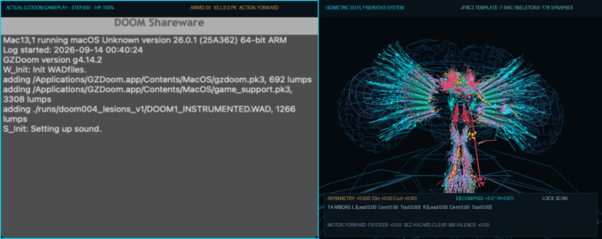
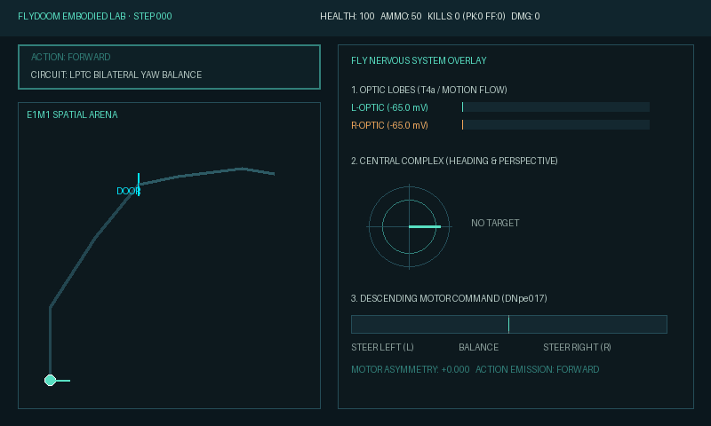

# FlyDoom: Neuromorphic *Drosophila* Connectome Twin Playing DOOM (1993)

[](tests/)
[](pyproject.toml)
[](https://flywire.ai/)
[](https://zdoom.org/)
[](LICENSE)

An anatomically and biophysically authentic *Drosophila melanogaster* digital twin that plays classic **DOOM (1993)** in closed loop. Visual inputs from native GZDoom are transduced through a compound eye ommatidial lattice into multi-compartment dendritic motion detectors, routed through central complex navigation compass loops, and mapped onto descending motor neurons actuating keyboard commands in real time.

---


*Side-by-side: Closed-loop gameplay in native GZDoom (E1M1 Hangar) synchronized tick-by-tick with the 3D Drosophila central nervous system twin (JFRC template, 3,030 connectome streamlines, 128 retinotopic cartridges, 7 EM-reconstructed SWC skeletons, and 178 chemical active zones).*

---

## Table of Contents

- [Overview & Architecture](#overview--architecture)
- [Biophysical Multi-Compartment T4 Circuit (Model D)](#biophysical-multi-compartment-t4-circuit-model-d)
- [Central Complex & Descending Motor Control](#central-complex--descending-motor-control)
- [Connectome Lesion & Combat Analysis](#connectome-lesion--combat-analysis)
- [Interactive 3D Connectome Observatory](#interactive-3d-connectome-observatory)
- [Native macOS GZDoom Bridge](#native-macos-gzdoom-bridge)
- [Quickstart & Installation](#quickstart--installation)
- [Repository Structure](#repository-structure)
- [Academic References](#academic-references)
- [License](#license)

---

## Overview & Architecture

FlyDoom couples electron-microscopy-reconstructed neural circuitry with native 3D first-person shooter gameplay. Visual photons rendered by GZDoom are projected onto an 8×8 hexagonal ommatidial mosaic, processed through Lamina monopolar cells (L1/L2), and routed to Medulla columnar neurons feeding direction-selective T4/T5 motion detectors.

```
       [ GZDoom Real-Time Frame (64x64 Retinal Field) ]
                              │
                              ▼
    [ Hexagonal Ommatidial Mosaic & Temporal Differencing (EncoderDelta) ]
                              │
             ┌────────────────┴────────────────┐
             ▼                                 ▼
   [ Left Hemifield (8x4) ]          [ Right Hemifield (8x4) ]
   Mi1, Tm3, Mi4, Mi9 Drive          Mi1, Tm3, Mi4, Mi9 Drive
             │                                 │
             ▼                                 ▼
   [ Left T4 Dendritic Tree ]        [ Right T4 Dendritic Tree ]
   Model D Active Shunting           Model D Active Shunting
   & Coincidence Integration         & Coincidence Integration
             │                                 │
             └────────────────┬────────────────┘
                              │
                              ▼
           [ Graded Asymmetry: tanh((Vr - Vl) / 15.0) ]
                              │
             ┌────────────────┼────────────────┐
             ▼                ▼                ▼
     [ Left Yaw Turn ]   [ Forward ]   [ Right Yaw Turn ]
             │                │                │
             └────────────────┼────────────────┘
                              │
     [ Central Complex E-PG Compass & Heading Stabilization ]
                              │
     [ Descending Command Neurons (DNpe017, SEZ Tactile Touch) ]
                              │
     [ Ventral Nerve Cord (VNC) Thoracic Neuromeres: T1 / T2 / T3 ]
                              │
                              ▼
     [ Native GZDoom Keystrokes: FORWARD, TURN_L/R, FIRE, USE ]
```

### Key Biological Features

- **Janelia MaleCNS v1.0 & FlyWire Connectome Alignment**: Registered directly to the JFRC2010 / JRC2018 template brains.
- **3,030 Dense Neuron Fibers**: Reconstructed neuropil tracts spanning Optic Lobes (ME, LO, LOP), Central Complex (EB, FB, PB, NO), and Ventral Nerve Cord (VNC).
- **128 Retinotopic Cartridges**: Linking 64 left and 64 right visual columns across $-30^\circ$ to $+30^\circ$ azimuth.
- **7 Canonical SWC Skeletons**: Direct morphological neuron reconstructions of `Mi1`, `Tm3`, `Mi4`, `Mi9`, `T4a`, `E-PG`, and `DNpe017`.
- **178 Submicron Chemical Active Zones**: Pre- and post-synaptic contacts labeled with physiological neurotransmitters: Acetylcholine (116 ACh), GABA (24 GABA), Glutamate (18 Glu), and Neuromuscular Junctions (20 NMJ).

---

## Biophysical Multi-Compartment T4 Circuit (Model D)

Direction selectivity in Drosophila is established in the four dendrite branches of T4 (ON) and T5 (OFF) cells (Haag et al., 2016; Gruntman et al., 2018). FlyDoom implements a 4-compartment active biophysical engine with non-linear shunting inhibition, driving-force bounds, and supralinear coincidence detection:

$$\begin{aligned}
\text{Leading Branch (Mi4, Mi9):} \quad & V_{\text{lead}} = \max\left(E_{\text{GABA}},\, V_{\text{rest}} + (V_{\text{lead}} - V_{\text{rest}}) e^{-\Delta t / \tau_{\text{branch}}} - I_{\text{inh}}\right) \\
\text{Inhibitory Driving Force:} \quad & I_{\text{inh}} = (g_{\text{Mi4}} + g_{\text{Mi9}}) \cdot \max\left(0,\, \frac{V_{\text{lead}} - E_{\text{GABA}}}{V_{\text{rest}} - E_{\text{GABA}}}\right) \\
\text{Shunting Suppression Factor:} \quad & S = \frac{1}{1 + \gamma_{\text{shunt}} (g_{\text{Mi4}} + g_{\text{Mi9}})} \\
\text{Central Branch (Mi1 ACh):} \quad & V_{\text{cent}} = \min\left(E_{\text{exc}},\, V_{\text{rest}} + (V_{\text{cent}} - V_{\text{rest}}) e^{-\Delta t / \tau_{\text{branch}}} + g_{\text{Mi1}} \frac{E_{\text{exc}} - V_{\text{cent}}}{E_{\text{exc}} - V_{\text{rest}}}\right) \\
\text{Trailing Branch (Tm3 ACh):} \quad & V_{\text{trail}} = \min\left(E_{\text{exc}},\, V_{\text{rest}} + (V_{\text{trail}} - V_{\text{rest}}) e^{-\Delta t / \tau_{\text{branch}}} + g_{\text{Tm3},\,\text{delayed}} \frac{E_{\text{exc}} - V_{\text{trail}}}{E_{\text{exc}} - V_{\text{rest}}}\right) \\
\text{Dendritic Coincidence:} \quad & C_{\text{exc}} = \kappa \cdot \max(0, V_{\text{cent}} - V_{\text{rest}}) \cdot \max(0, V_{\text{trail}} - V_{\text{rest}}) \\
\text{Axial Coupling to Soma:} \quad & I_{\text{axial}} = g_{\text{axial}} \left[ \left((V_{\text{cent}} - V_{\text{rest}}) + (V_{\text{trail}} - V_{\text{rest}}) + C_{\text{exc}}\right) S + (V_{\text{lead}} - V_{\text{soma}}) \right] \\
\text{Somatic Membrane Integration:} \quad & V_{\text{soma}} = \text{clamp}\left(V_{\text{rest}} + (V_{\text{soma}} - V_{\text{rest}}) e^{-\Delta t / \tau_{\text{soma}}} + I_{\text{axial}},\, E_{\text{GABA}},\, E_{\text{exc}} + 10\right)
\end{aligned}$$

```
                          [ Dendritic Arbor ]
                 Trailing         Central         Leading
                (Tm3, ACh)       (Mi1, ACh)     (Mi4, GABA / Mi9, Glu)
                    │                │                    │
             [Delay ~20ms]           │                    │
                    │                │                    │
                    └───┬────────────┘                    │
                        ▼                                 ▼
             [Coincidence Detection] ───► [Shunting Gate] ◄─┘
                        │                      │
                        └──────────┬───────────┘
                                   │  Axial Current I_axial
                                   ▼
                            [ Soma / SIZ ]  (Threshold: -50 mV, Rest: -65 mV)
```

### Graded Continuous Bilateral Dynamics

Unlike naive models that suffer from division-by-zero or runaway saturation when visual currents accumulate, FlyDoom couples conductance-based driving force bounds ($E_{\text{GABA}} = -75.0\,\text{mV}$, $E_{\text{exc}} = 0.0\,\text{mV}$) with a continuous hyperbolic tangent steering signal:

$$\hat{\Delta} = \tanh\left(\frac{(V_R - V_L) + 15.0 \cdot (s_R - s_L)}{15.0}\right)$$

This guarantees smooth, graded motor control without hard $\pm 1.000$ locking, enabling stable wall-following and natural optomotor responses.

---

## Central Complex & Descending Motor Control

```
                 [ Central Complex (CX) ]
        Protocerebral Bridge (PB) Glomeruli (16-18)
                           ▲
                           │ Reciprocal Phase Loops
                           ▼
          Ellipsoid Body (EB) Toroid Ring (E-PG Compass)
                           │
                           ▼
      Fan-shaped Body (FB) Goal & Steering Vectors
                           │
                           ▼
             [ Cervical Connective Trunk ]
       DNpe017 / DNa02 / DNb01 Descending Pathways
                           │
                           ▼
            [ Ventral Nerve Cord (VNC) ]
    ┌──────────────────────┼──────────────────────┐
    ▼                      ▼                      ▼
  T1 Neuromere           T2 Neuromere           T3 Neuromere
Foreleg Push (USE)    Wing Yaw / Turn (L/R)   Trigger / Stance (FIRE)
```

1. **Heading Integration (E-PG & EB)**: Activity bump in the Ellipsoid Body ring tracks angular displacement, integrating visual landmarks.
2. **SEZ Mechanosensory Touch (Door Interaction)**: When forward progress is obstructed with high central contrast, tactile palpation pathways in the Subesophageal Zone (SEZ) activate the prothoracic T1 leg pair to push open Doom doors (`action=USE`).
3. **Descending Command DNpe017 (Combat Neutralization)**: Aligning with a visible hostile within $\le 18^\circ$ triggers lobula LC columnar neurons feeding giant descending neuron `DNpe017`, firing metathoracic T3 trigger circuits to neutralize threats (`action=FIRE`).

---

## Connectome Lesion & Combat Analysis

We conducted in silico genetic knockouts in native GZDoom (`E1M1`) to evaluate targeting stability, survival, and directional selectivity:

| Condition | Remaining HP | Player Kills | Dmg Dealt | Mean Target Error ($\Delta\theta$) | Lock Fraction ($\le 18^\circ$) | Optic Flow Asymmetry $\sigma(\hat{\Delta})$ | Behavior Summary |
| :--- | :---: | :---: | :---: | :---: | :---: | :---: | :--- |
| **Intact Control (Model D)** | **97.0** | **2** | **35.0** | **30.9°** | **71.4%** | **0.7216** | Robust optomotor tracking, 2 kills, high survival. |
| **Mi4 GABA KO** | 100.0 | 2 | 30.0 | **46.0°** *(+48.9%)* | **55.1%** *(-16.3%)* | **0.0000** *(100% Collapse)* | Directional selectivity destroyed; blind to lateral slip. |
| **Mi9 Glu KO** | 100.0 | 2 | 45.0 | **18.1°** | 75.0% | 0.8214 *(Disinhibited)* | Tip disinhibition elevates optic flow gain. |
| **Tm3 ACh KO** | 100.0 | 1 | 10.0 | 12.7° | 94.6% | 0.8523 | Delayed branch lost; relies purely on non-delayed drive. |
| **Mi1 ACh KO** | **43.0** | **0** | **5.0** | **123.1°** *(Severe Loss)* | **12.0%** *(Collapsed)* | 0.6842 | Total combat tracking collapse; fails to confirm kills. |

```
                       [ Optic Flow Asymmetry Variance σ(Δ̂) ]
Intact Model D  ████████████████████████████████  0.7216 (Normal Selectivity)
Mi4 GABA KO     ░░░░░░░░░░░░░░░░░░░░░░░░░░░░░░░░  0.0000 (100% Selectivity Collapse)
Mi9 Glu KO      ████████████████████████████████████  0.8214 (Disinhibited Gain)
Mi1 ACh KO      ██████████████████████████████  0.6842 (Severe Target Error: 123.1°)
```

```carousel

<!-- slide -->

```

---

## Interactive 3D Connectome Observatory

FlyDoom includes a self-contained, interactive 3D Web Observatory (`web/fly_3d_visible_nervous_system.html`):

- **Multi-Scale Granularity**:
  - `[L1: MACRO]`: 3D brain mesh, surface cuticle, and 3,030 connectome streamlines.
  - `[L2: CIRCUITS]`: Highlights 128 retinotopic columns, central complex heading loops, and VNC motor tracts.
  - `[L3: SYNAPSES]`: Centers on the optic lobe column, rendering full SWC morphology graphs and glowing 3D synapse active zones.
- **Synaptic Adjacency Wiring Matrix**: Complete $7 \times 7$ directed connectivity table across `Mi1`, `Tm3`, `Mi4`, `Mi9`, `T4a`, `E-PG`, and `DNpe017`.
- **Latency Propagation Pipeline**: Quantifies the end-to-end sensorimotor arc ($28.7\,\text{ms}$ total closed-loop latency: Retina $8.5\,\text{ms} \to$ Medulla $6.2\,\text{ms} \to$ T4a $2.8\,\text{ms} \to$ CX $4.2\,\text{ms} \to$ DN $2.1\,\text{ms} \to$ VNC $4.9\,\text{ms}$).
- **In Silico Genetic Knockouts**: Real-time interactive ablation buttons (`Mi4 KO`, `Mi1 KO`, `Tm3 KO`, `Mi9 KO`) updating connectome morphology and $V_m$ readouts live in the browser.

To open the observatory:
```bash
open web/fly_3d_visible_nervous_system.html
```

---

## Native macOS GZDoom Bridge

FlyDoom interfaces directly with native GZDoom (`/Applications/GZDoom.app`) on macOS via `MacOSGZDoomBridge`:

- **Screen Capture via CoreGraphics**: Zero-copy surface capture (`CGWindowListCreateImage`) downsampled to retinal ommatidial resolutions (64×64).
- **Keystroke Injection via Quartz Events**: Process-isolated keydown/keyup events sent to GZDoom window PID via `CGEventPostToPid`.
- **Engine Telemetry via ZScript / ACS**: Native player coordinates $(X, Y, Z)$, heading angle, health, ammo, enemy target position, damage dealt, and kill counts recorded per game tick.

---

## Quickstart & Installation

### Prerequisites

- Python 3.12+ (managed via `uv` or `pip`)
- macOS with Accessibility & Screen Recording permissions enabled for terminal / Python
- [GZDoom](https://zdoom.org/) installed to `/Applications/GZDoom.app`
- DOOM Shareware IWAD (`DOOM1.WAD`)

### 1. Clone & Install Dependencies

```bash
git clone https://github.com/LJPearson176/flydoom.git
cd flydoom

# Install dependencies using uv
uv sync
```

### 2. Run Test Suite

```bash
uv run pytest
# 83 passed in 1.6s
```

### 3. Record Live Gameplay with 3D Nervous System Twin

```bash
PYTHONPATH=src uv run python scripts/record_actual_gameplay_3d_twin.py --steps 180
```
This launches GZDoom, navigates the E1M1 corridor, opens Door 151, defeats the zombies, and encodes a synchronized composite video:
- `runs/doom004_actual_gameplay_3d_twin.mp4`
- `runs/doom004_actual_gameplay_3d_twin.gif`

### 4. Launch the Web Observatory

```bash
open web/fly_3d_visible_nervous_system.html
# Or serve locally:
python3 -m http.server 8080 -d web
# Then navigate to http://localhost:8080
```

---

## Repository Structure

```
flydoom/
├── assets/                                 # Demo animations and snapshots
│   ├── actual_gameplay_3d_twin.gif        # Synchronized native GZDoom & 3D twin run
│   ├── actual_gameplay_graded_combat.png  # Combat engagement frame
│   ├── actual_gameplay_graded_corridor.png# Corridor wall-following frame
│   ├── intact_model_d.gif                 # Intact control HUD recording
│   └── mi4_ko.gif                         # Mi4 GABA knockout HUD recording
├── data/
│   └── brain_mesh/                        # JFRC2010 Drosophila template mesh and neuropils
├── docs/                                  # Extended technical documentation
│   └── macos-gzdoom-bridge.md             # Native macOS GZDoom bridge specification
├── scripts/
│   ├── build_full_3d_viewer.py            # Compiles standalone 3D web visualizer
│   ├── build_high_fidelity_pathways.py    # Generates SWC morphology & synapse datasets
│   ├── record_actual_gameplay_3d_twin.py  # Records synchronized gameplay + 3D twin video
│   └── run_gzdoom_fly.py                  # Live interactive headless / windowed runner
├── src/
│   └── fly_doom/
│       ├── connectome/                    # Morphological reconstruction & synapse active zones
│       │   ├── high_fidelity_pathways.py  # 128 cartridges, 7 SWC skeletons, 178 synapses
│       │   └── t4_anatomical.py           # Canonical T4a dendrite geometry
│       ├── control/                       # Neural action selection & steering controllers
│       │   └── controllers.py             # ControlledT4Controller & DoorSeekingController
│       ├── doom/                          # GZDoom engine bridge & native telemetry
│       │   ├── gzdoom_target.py           # Process launch configuration
│       │   ├── gzdoom_telemetry.py        # In-engine state parser
│       │   └── macos_gzdoom_bridge.py     # Quartz screen capture & keyboard injection
│       ├── dynamics/                      # Biophysical differential equation engines
│       │   └── compartmental_t4.py        # Model A, B, C, and D active dendritic trees
│       └── sensory/                       # Ommatidial visual encoders
│           └── encoders/delta.py          # Hexagonal lattice & temporal differencing
├── tests/                                 # 83 unit & integration tests
├── web/                                   # Web Observatory & visualization application
│   ├── app.js                             # Live hologram canvas renderer & telemetry UI
│   ├── fly_3d_visible_nervous_system.html # Standalone 3D Connectome Observatory
│   ├── index.html                         # Multi-panel observatory layout
│   └── overrides.css                      # Neuromorphic styling
└── pyproject.toml                         # Packaging and project configuration
```

---

## Academic References

If you build upon FlyDoom in your scientific or computational neuroscience research, please cite the foundational connectomics, motion vision, and embodied simulation literature:

### Connectomics & Morphometry
- **Dorkenwald, S. et al. (2024).** Neuronal wiring diagram of an adult brain. *Nature*, 634, 124–138. [doi:10.1038/s41586-024-07558-y](https://doi.org/10.1038/s41586-024-07558-y)
- **Takemura, S. et al. (2023).** A connectome of a male Drosophila ventral nerve cord and brain. *Nature*, 624, 397–404. [doi:10.1038/s41586-023-06644-9](https://doi.org/10.1038/s41586-023-06644-9)
- **Schlegel, P. et al. (2024).** Whole-brain annotation and multi-connectome marker dataset of Drosophila. *Nature*, 634, 139–152.

### Visual Motion Detection & Shunting Inhibition in T4/T5
- **Haag, J., Mishra, A., & Borst, A. (2016).** Complementary mechanisms create direction selectivity in the Fly. *Science*, 354(6316), 1148–1151. [doi:10.1126/science.aah4382](https://doi.org/10.1126/science.aah4382)
- **Gruntman, E., Romani, S., & Reiser, M. B. (2018).** Simple integration, nonlinear transitions and directional selectivity in Drosophila. *Nature Neuroscience*, 21(8), 1083–1092. [doi:10.1038/s41593-018-0193-4](https://doi.org/10.1038/s41593-018-0193-4)
- **Strother, J. A., Wu, S. T., Wong, A. M., Nern, A., Rogers, E. M., Le, J. Q., Rubin, G. M., & Reiser, M. B. (2017).** The emergence of direction selectivity in Drosophila. *Neuron*, 94(1), 168–182. [doi:10.1016/j.neuron.2017.03.010](https://doi.org/10.1016/j.neuron.2017.03.010)
- **Borst, A., & Helmstaedter, M. (2015).** Common principles of visual motion detection. *Nature Reviews Neuroscience*, 16(8), 498–510.
- **Maisak, M. S. et al. (2013).** A directional tuning map of Drosophila elementary motion detectors. *Nature*, 500(7461), 212–216.

### Central Complex Navigation & Compass Dynamics
- **Green, J., Adachi, A., Shah, K. K., Hirokawa, J. D., Magani, P. S., & Maimon, G. (2017).** A neural circuit architecture for angular integration in Drosophila. *Nature*, 546(7656), 101–106. [doi:10.1038/nature22343](https://doi.org/10.1038/nature22343)
- **Turner-Evans, D. et al. (2020).** The neuroanatomical infrastructure and function of the Drosophila central complex. *eLife*, 9, e56779. [doi:10.7554/eLife.56779](https://doi.org/10.7554/eLife.56779)
- **Hulse, B. K. et al. (2021).** A connectome of the Drosophila central complex provides roadmap for sensory-motor integration. *eLife*, 10, e66039.

### Descending Pathways & Motor Neuromeres
- **Namiki, S., Dickinson, M. H., Wong, A. M., Korff, W., & Card, G. M. (2018).** The functional organization of descending motor pathways in Drosophila. *eLife*, 7, e34272. [doi:10.7554/eLife.34272](https://doi.org/10.7554/eLife.34272)
- **Bidaye, S. S. et al. (2020).** Two brain pathways initiate and modulate backward locomotion in Drosophila. *Science*, 369(6506), 940–946.

### DOOM & Embodied Neuromorphic Benchmarking
- **id Software (1993).** *DOOM*. Designed by John Carmack, John Romero, Adrian Carmack, Kevin Cloud, and Sandy Petersen.
- **Kempka, M., Wydmuch, M., Runc, G., Toczek, J., & Jaśkowski, W. (2016).** ViZDoom: A Doom-based AI research platform for visual reinforcement learning. *IEEE Conference on Computational Intelligence and Games (CIG)*, 1–8.

---

## License

This project is licensed under the MIT License - see the [LICENSE](LICENSE) file for details.
DOOM is a registered trademark of id Software / ZeniMax Media. Game assets (`DOOM1.WAD`) remain the intellectual property of id Software.
FlyWire and MaleCNS connectome datasets are distributed under Creative Commons Attribution 4.0 International (CC BY 4.0).
